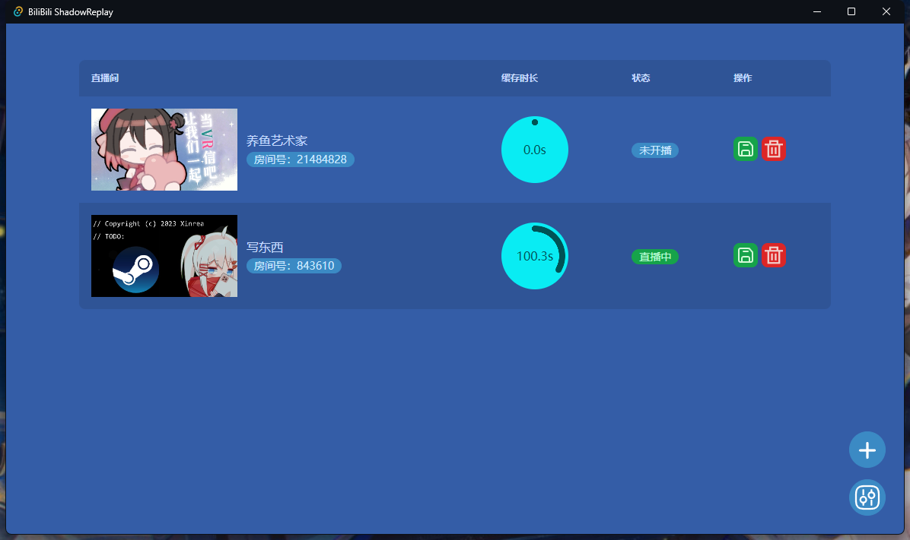
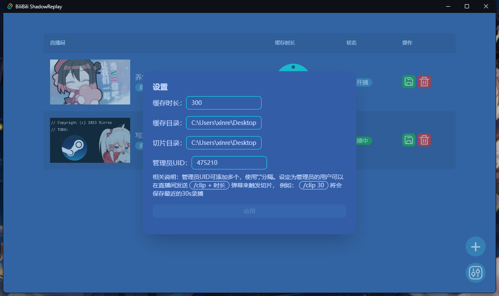

# Bilibili ShadowReplay

> 点击关闭后程序仍会在后台运行，请找到托盘区的图标右键退出程序

## 介绍

Bilibili ShadowReplay 是一个用于缓存B站直播的工具，可以将直播的视频缓存到本地，便于及时保存回放，方便后期剪辑工作。

除了在界面上手动操作外，还可以通过弹幕触发切片。

> 只有管理员UID设置中的用户才能触发切片

## 设置

- `缓存时长`：缓存的视频时长，单位为秒
- `缓存目录`：缓存的视频存放目录
- `切片目录`: 切片的视频存放目录
- `管理员UID`：B站的UID，用于判断是否有权限在直播间通过弹幕触发切片；可设置多个，使用英文逗号分隔。