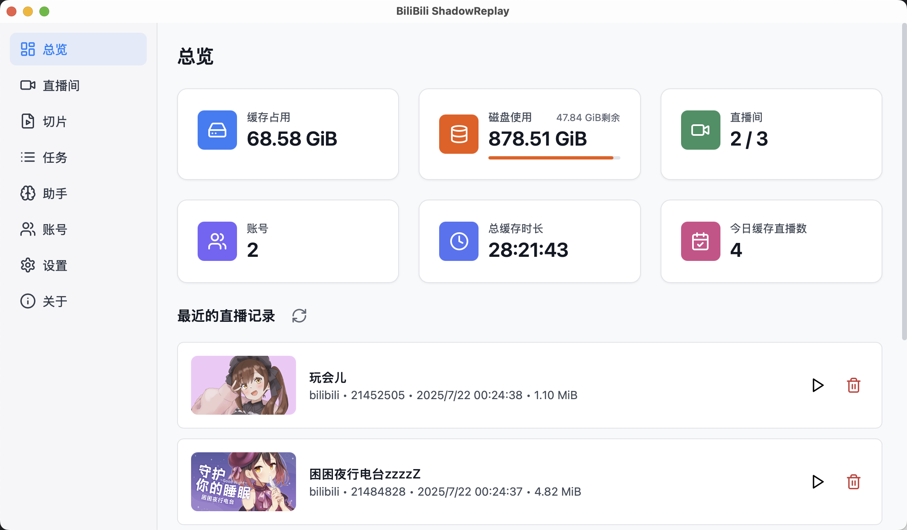

# BiliBili ShadowReplay

BiliBili ShadowReplay 是一个缓存直播并进行实时编辑投稿的工具。通过划定时间区间，并编辑简单的必需信息，即可完成直播切片以及投稿，将整个流程压缩到分钟级。同时，也支持对缓存的历史直播进行回放，以及相同的切片编辑投稿处理流程。

目前仅支持 B 站和抖音平台的直播。

## 安装和使用

前往网站查看说明：[BiliBili ShadowReplay](https://bsr.xinrea.cn/)

## 参与开发

[Contributing](.github/CONTRIBUTING.md)

## 赞助

