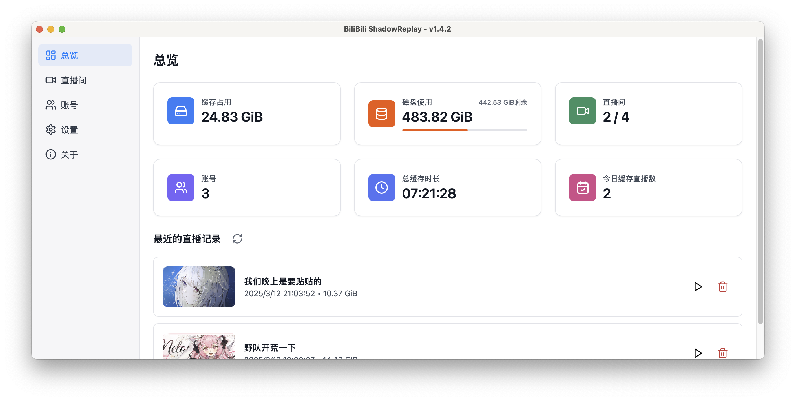
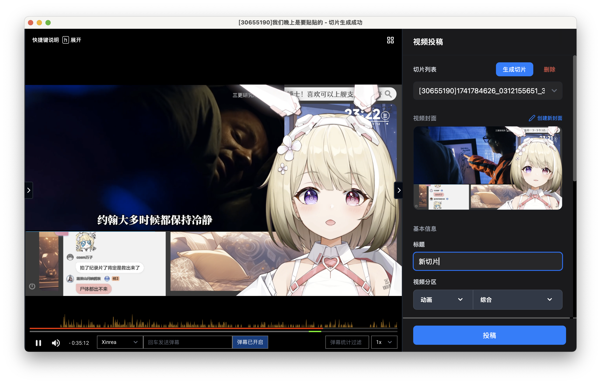

# BiliBili ShadowReplay


BiliBili ShadowReplay 是一个缓存直播并进行实时编辑投稿的工具。通过划定时间区间，并编辑简单的必需信息，即可完成直播切片以及投稿，将整个流程压缩到分钟级。同时，也支持对缓存的历史直播进行回放，以及相同的切片编辑投稿处理流程。

目前仅支持 B 站和抖音平台的直播。



## Headless

BiliBili ShadowReplay 支持无界面模式，提供 Web 控制界面，可以用于在服务器等无图形界面环境下部署使用。

使用方法：

```bash
sudo docker run -it -d\
    -p 3000:3000 \
    -v $DATA_DIR:/app/data \
    -v $CACHE_DIR:/app/cache \
    -v $OUTPUT_DIR:/app/output \
    -v $CONFIG_FILE:/app/config.toml \
    --name bili-shadowreplay \
    ghcr.io/xinrea/bili-shadowreplay:latest
```

## 参与开发

[Contributing](.github/CONTRIBUTING.md)

## 总览


## 直播间管理


显示当前缓存的直播间列表，在添加前需要在账号页面添加至少一个账号（主账号）用于直播流以及用户信息的获取。
操作菜单包含打开直播流、查看历史记录以及删除等操作。其中历史记录以列表形式展示，可以进行回放以及删除。


无论是正在进行的直播还是历史录播，都可在预览窗口进行回放，同时也可以进行切片编辑以及投稿。关于预览窗口的相关说明请见 [预览窗口](#预览窗口)。

## 账号管理


程序需要至少一个账号用于直播流以及用户信息的获取，可以在此页面添加账号。

你可以添加多个账号，但只有一个账号会被标记为主账号，主账号用于直播流的获取。所有账号都可在切片投稿或是观看直播流发送弹幕时自由选择，详情见 [预览窗口](#预览窗口)。

抖音账号目前仅支持手动 Cookie 添加，且账号仅用于获取直播信息和直播流。

## 预览窗口



预览窗口是一个多功能的窗口，可以用于观看直播流、回放历史录播、编辑切片、记录时间点以及投稿等操作。如果当前播放的是直播流，那么会有实时弹幕观看以及发送弹幕相关的选项。

通过预览窗口的快捷键操作，可以快速选择时间区间，进行切片生成以及投稿。

无论是弹幕发送还是投稿，均可自由选择账号，只要在账号管理中添加了该账号。

进度条上方会显示弹幕频率图，可以直观地看到弹幕的分布情况；右侧的弹幕统计过滤器可以用于过滤弹幕，只显示含有指定文字的弹幕的统计情况。

## 封面编辑


在预览窗口中，生成切片后可以进行封面编辑，包括关键帧的选择、文字的添加和拖动等。

## 设置


在设置页面可以进行一些基本的设置，包括缓存和切片的保存路径，以及相关事件是否显示通知等。

> [!WARNING]
> 缓存目录进行切换时，会有文件复制等操作，如果缓存量较大，可能会耗费较长时间；且在此期间预览功能会暂时失效，需要等待操作完成。
