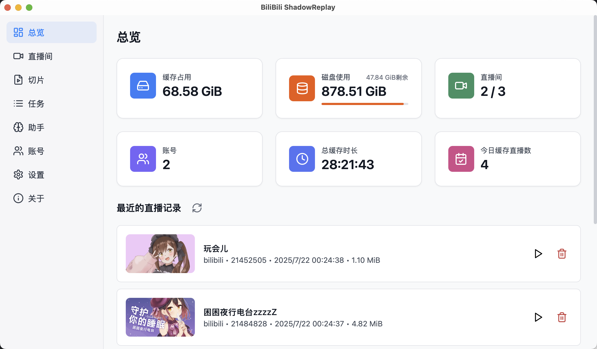

# BiliBili ShadowReplay

BiliBili ShadowReplay 是一个缓存直播并进行实时编辑投稿的工具。通过划定时间区间，并编辑简单的必需信息，即可完成直播切片以及投稿，将整个流程压缩到分钟级。同时，也支持对缓存的历史直播进行回放，以及相同的切片编辑投稿处理流程。

目前仅支持 B 站和抖音平台的直播。

<a href="https://www.star-history.com/?repos=Xinrea%2Fbili-shadowreplay&type=date&legend=top-left">
 <picture>
   <source media="(prefers-color-scheme: dark)" srcset="https://api.star-history.com/chart?repos=Xinrea/bili-shadowreplay&type=date&theme=dark&legend=top-left&sealed_token=GCmcFpkQTCuEqW_rIRCZ21PScDC720HSMSW-a2072yWtQBwcRI8VWAU75Twihm6-zln36reOXu9jvnli7bOpa5gZCjJU5N9wi7E3mKCOGL0ltlz23581AhmRwC9sXRJTN6-S_LpCiE6KZez6JOEuDEUoAji2HEmndaVPhqgg01fILhVNwqmBdnoy-SJ2" />
   <source media="(prefers-color-scheme: light)" srcset="https://api.star-history.com/chart?repos=Xinrea/bili-shadowreplay&type=date&legend=top-left&sealed_token=GCmcFpkQTCuEqW_rIRCZ21PScDC720HSMSW-a2072yWtQBwcRI8VWAU75Twihm6-zln36reOXu9jvnli7bOpa5gZCjJU5N9wi7E3mKCOGL0ltlz23581AhmRwC9sXRJTN6-S_LpCiE6KZez6JOEuDEUoAji2HEmndaVPhqgg01fILhVNwqmBdnoy-SJ2" />
   
 </picture>
</a>

## 安装和使用

前往网站查看说明：[BiliBili ShadowReplay](https://bsr.xinrea.cn/)

## 参与开发

可以通过 [DeepWiki](https://deepwiki.com/Xinrea/bili-shadowreplay) 了解本项目。

贡献指南：[Contributing](.github/CONTRIBUTING.md)

## 赞助

<!-- markdownlint-disable MD033 -->

