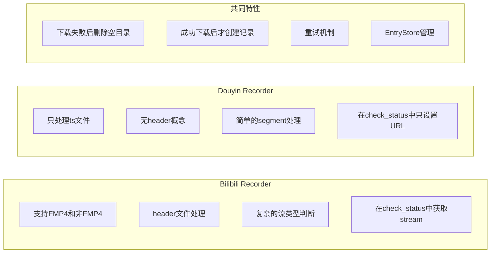
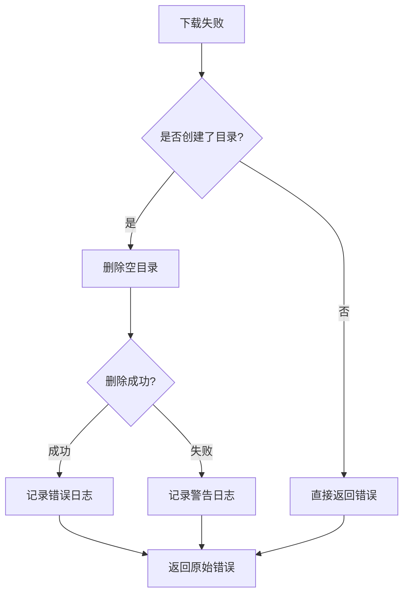

# Recorder 执行流程图

## Bilibili Recorder 流程

```mermaid
flowchart TD
    A[开始 run()] --> B[检查 check_status()]
    B --> C{直播状态?}
    C -->|未直播| D[等待2-5秒] --> B
    C -->|直播中| E[获取 stream URL]
    E --> F[调用 update_entries()]
    
    F --> G{stream类型?}
    
    %% FMP4流程
    G -->|FMP4| H[检查是否需要header]
    H --> I{需要header?}
    I -->|是| J[创建工作目录]
    J --> K[下载header文件]
    K --> L{下载成功?}
    L -->|失败| M[删除空目录] --> N[返回错误]
    L -->|成功| O[创建数据库记录]
    O --> P[初始化EntryStore和DanmuStorage]
    P --> Q[解析m3u8播放列表]
    
    %% 非FMP4流程
    G -->|非FMP4| R{是否首次录制?}
    R -->|是| S[创建工作目录] --> T[下载ts文件]
    R -->|否| T[下载ts文件]
    T --> U{下载成功?}
    U -->|失败| V[删除空目录] --> N
    U -->|成功且首次| W[创建数据库记录]
    W --> X[初始化EntryStore和DanmuStorage]
    X --> Y[添加ts条目]
    U -->|成功且非首次| Y
    
    %% 公共流程
    I -->|否| Q
    Q --> Z[遍历ts片段]
    Z --> AA[下载ts片段]
    Y --> BB[更新记录]
    AA --> CC{下载成功?}
    CC -->|成功| DD[添加到EntryStore] --> BB
    CC -->|失败| EE[重试] --> CC
    EE --> FF{重试次数用完?}
    FF -->|是| N
    FF -->|否| CC
    
    BB --> GG{继续录制?}
    GG -->|是| F
    GG -->|否| HH[结束录制]
```

## Douyin Recorder 流程

```mermaid
flowchart TD
    A[开始 run()] --> B[检查 check_status()]
    B --> C{直播状态?}
    C -->|未直播| D[reset并等待] --> B
    C -->|直播中| E[设置stream_url和danmu_room_id]
    E --> F[调用 update_entries()]
    
    F --> G{是否首次录制?}
    G -->|是| H[生成live_id]
    G -->|否| I[获取现有工作目录]
    
    H --> J[准备工作目录路径]
    J --> K[解析m3u8播放列表]
    I --> K
    
    K --> L[遍历segment]
    L --> M{是否新segment?}
    M -->|否| L
    M -->|是| N{是否首次segment?}
    
    N -->|是| O[创建工作目录]
    N -->|否| P[下载ts文件]
    
    O --> P[下载ts文件]
    P --> Q{下载成功?}
    
    Q -->|失败| R[重试机制]
    R --> S{重试次数用完?}
    S -->|否| P
    S -->|是| T[删除空目录] --> U[返回错误]
    
    Q -->|成功且首次| V[创建数据库记录]
    V --> W[初始化EntryStore和DanmuStorage]
    W --> X[启动弹幕任务]
    X --> Y[添加ts条目]
    
    Q -->|成功且非首次| Y
    Y --> Z[更新last_update]
    Z --> AA{继续录制?}
    AA -->|是| F
    AA -->|否| BB[结束录制]
```

## 两种 Recorder 的关键差异



## 错误处理流程



## 状态管理对比

| 状态变量 | Bilibili | Douyin | 用途 |
|---------|----------|--------|------|
| `live_id` | 时间戳字符串 | 时间戳字符串 | 唯一标识本次直播 |
| `entry_store` | Option\<EntryStore\> | Option\<EntryStore\> | ts文件条目管理 |
| `danmu_storage` | Option\<DanmuStorage\> | - | 弹幕存储(Bilibili) |
| `danmu_store` | - | DanmuStorage | 弹幕存储(Douyin) |
| `live_stream` | Option\<Stream\> | - | 流信息(Bilibili) |
| `stream_url` | - | Option\<String\> | 流URL(Douyin) |
| `is_recording` | bool | - | 录制状态(Bilibili) |
| `last_update` | i64 | Arc\<RwLock\<i64\>\> | 最后更新时间 |