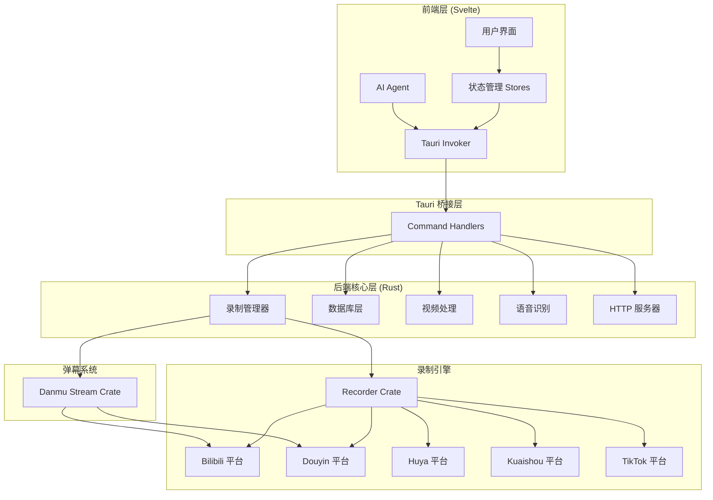
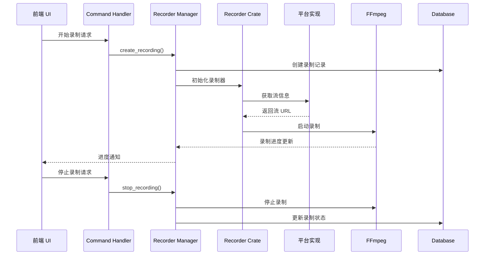
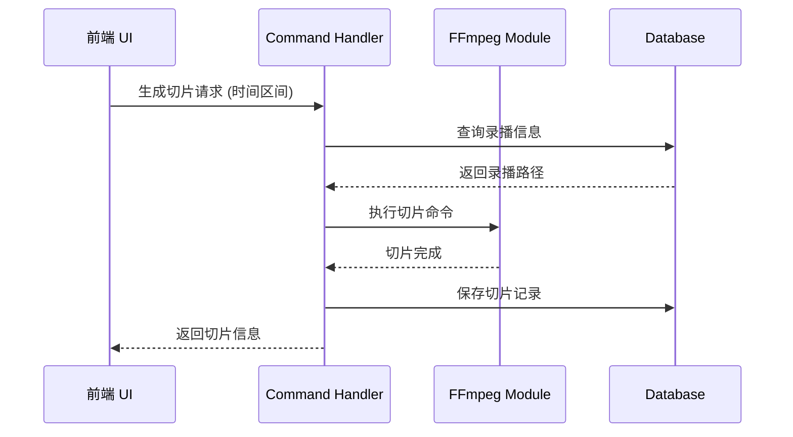

# 架构概览

## 技术栈

BiliBili ShadowReplay 是一个基于 Tauri 2 的混合桌面应用，采用前后端分离架构。

### 前端技术栈

- **框架**: Svelte 3 + TypeScript
- **构建工具**: Vite
- **UI 框架**: Tailwind CSS + Flowbite
- **AI 集成**: LangChain (@langchain/core, @langchain/deepseek, @langchain/ollama)
- **音频可视化**: WaveSurfer.js
- **实时通信**: Socket.io

### 后端技术栈

- **桌面框架**: Tauri 2
- **语言**: Rust (async/await with Tokio)
- **数据库**: SQLite with sqlx (WAL mode)
- **视频处理**: FFmpeg (via async-ffmpeg-sidecar)
- **语音识别**: Whisper-rs (支持 CUDA/Metal 加速)
- **流媒体处理**: M3U8-rs
- **HTTP 服务**: Axum
- **WebSocket**: Socketioxide

## 系统架构



## 目录结构

### 前端目录结构

```
src/
├── main.ts              # 主应用入口
├── main_clip.ts         # 切片编辑界面入口
├── main_live.ts         # 直播界面入口
├── page/                # 页面组件
│   ├── Room.svelte      # 直播间管理
│   ├── Task.svelte      # 任务管理
│   ├── AI.svelte        # AI 助手
│   └── ...
├── lib/
│   ├── components/      # 可复用 UI 组件
│   ├── stores/          # Svelte 状态管理
│   ├── agent/           # AI Agent 实现
│   ├── db.ts            # 前端数据库接口
│   ├── interface.ts     # TypeScript 类型定义
│   └── invoker.ts       # Tauri 命令调用封装
└── ...
```

### 后端目录结构

```
src-tauri/
├── src/
│   ├── main.rs                  # 主入口
│   ├── recorder_manager.rs      # 录制管理器
│   ├── handlers/                # Tauri 命令处理器
│   ├── database/                # 数据库操作
│   ├── subtitle_generator/      # 字幕生成
│   ├── ffmpeg/                  # FFmpeg 集成
│   ├── progress/                # 进度跟踪
│   ├── http_server/             # HTTP 服务器
│   ├── webhook/                 # Webhook 支持
│   ├── jianying/                # 剪映集成
│   ├── task/                    # 任务管理
│   ├── static_server/           # 静态文件服务
│   └── migration/               # 数据库迁移
├── crates/
│   ├── recorder/                # 录制核心库
│   │   └── src/
│   │       └── platforms/       # 平台实现
│   │           ├── bilibili/
│   │           ├── douyin/
│   │           ├── huya/
│   │           ├── kuaishou/
│   │           └── tiktok/
│   └── danmu_stream/            # 弹幕流处理库
└── ...
```

## 核心模块说明

### 前端核心模块

- **Stores**: 使用 Svelte 的响应式存储管理全局状态
- **Invoker**: 封装 Tauri 命令调用，提供类型安全的前后端通信
- **Agent**: 基于 LangChain 的 AI 助手，支持内容分析和总结
- **Components**: 可复用的 UI 组件库

### 后端核心模块

- **Recorder Manager**: 协调录制任务的创建、启动、停止和监控
- **Database**: SQLite 数据库操作，使用 sqlx 提供异步接口
- **FFmpeg**: 视频处理和转码，支持切片生成、字幕压制等
- **Subtitle Generator**: 基于 Whisper 的语音识别和字幕生成
- **HTTP Server**: 提供流媒体服务和 Web 控制界面

### 自定义 Crate

- **recorder**: 核心录制功能，包含多平台实现
- **danmu_stream**: 弹幕流处理，支持实时弹幕捕获和存储

## 数据流

### 录制流程



### 切片生成流程



## 平台支持

目前支持以下直播平台：

- **Bilibili**: 完整支持，包括录制、弹幕、投稿
- **Douyin (抖音)**: 支持录制和弹幕
- **Huya (虎牙)**: 支持录制
- **Kuaishou (快手)**: 支持录制
- **TikTok**: 支持录制

每个平台的实现位于 `src-tauri/crates/recorder/src/platforms/<platform>/` 目录。

## 数据库架构

使用 SQLite 作为主要存储，启用 WAL (Write-Ahead Logging) 模式以支持并发访问。

主要数据表：
- **rooms**: 直播间配置
- **recordings**: 录播记录
- **clips**: 切片记录
- **tasks**: 任务状态
- **accounts**: 账号信息
- **settings**: 用户配置

数据库迁移系统位于 `src-tauri/src/migration/`，在应用启动时自动执行。

## AI 功能

### Whisper 集成

- 本地语音转文字
- 平台特定加速：
  - Windows: 可选 CUDA 支持 (通过 `cuda` feature)
  - macOS: 默认启用 Metal 加速
  - Linux: CPU 推理

### LangChain 集成

- AI 助手用于内容分析和总结
- 支持多个 LLM 提供商 (DeepSeek, Ollama)
- 位于 `src/lib/agent/` 目录

## 构建配置

### 平台特定构建

- **Windows CPU**: `yarn tauri dev` (默认)
- **Windows CUDA**: `yarn tauri dev --features cuda`
- **macOS**: 需要设置 `SDKROOT` 和 `CMAKE_OSX_DEPLOYMENT_TARGET=13.3`
- **Linux**: 无特殊配置

### 配置文件

- `tauri.conf.json`: 主配置
- `tauri.{macos,linux,windows,windows.cuda}.conf.json`: 平台特定配置
- `src-tauri/config.example.toml`: 用户配置模板
