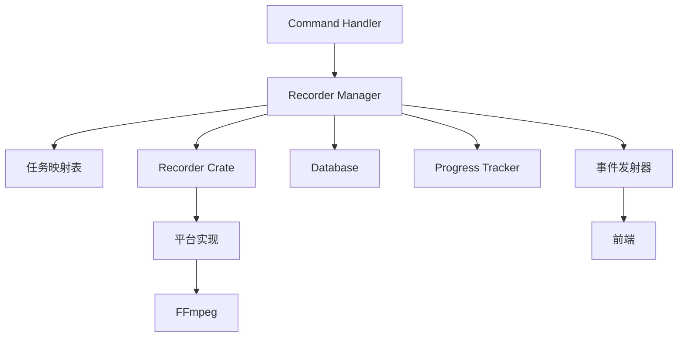

# 录制管理器 (Recorder Manager)

## 概述

`recorder_manager.rs` 是录制系统的核心协调器，负责管理所有录制任务的生命周期。位于 `src-tauri/src/recorder_manager.rs`。

## 主要职责

1. **任务管理**: 创建、启动、停止、监控录制任务
2. **状态跟踪**: 维护所有活跃录制的状态
3. **资源协调**: 协调 Recorder Crate、FFmpeg、数据库等资源
4. **错误处理**: 处理录制过程中的各种错误情况
5. **事件通知**: 向前端发送录制状态更新

## 架构



## 核心数据结构

### RecorderManager

```rust
pub struct RecorderManager {
    // 活跃的录制任务
    active_recordings: Arc<Mutex<HashMap<String, RecordingTask>>>,

    // 数据库连接池
    db_pool: SqlitePool,

    // Tauri App Handle (用于发送事件)
    app_handle: AppHandle,

    // 配置
    config: Arc<RwLock<Config>>,
}

impl RecorderManager {
    pub fn new(db_pool: SqlitePool, app_handle: AppHandle) -> Self {
        Self {
            active_recordings: Arc::new(Mutex::new(HashMap::new())),
            db_pool,
            app_handle,
            config: Arc::new(RwLock::new(Config::load())),
        }
    }
}
```

### RecordingTask

```rust
struct RecordingTask {
    // 任务 ID
    id: String,

    // 直播间 ID
    room_id: String,

    // 录制器实例
    recorder: Box<dyn Recorder>,

    // 任务状态
    status: RecordingStatus,

    // 开始时间
    start_time: DateTime<Utc>,

    // 输出文件路径
    output_path: PathBuf,

    // 取消令牌
    cancel_token: CancellationToken,
}

#[derive(Debug, Clone)]
enum RecordingStatus {
    Initializing,
    Recording,
    Stopping,
    Stopped,
    Error(String),
}
```

## 主要方法

### 创建录制任务

```rust
impl RecorderManager {
    /// 创建新的录制任务
    pub async fn create_recording(
        &self,
        room_id: String,
        platform: Platform,
    ) -> Result<String, RecorderError> {
        // 1. 生成任务 ID
        let recording_id = Uuid::new_v4().to_string();

        // 2. 在数据库中创建记录
        let recording = database::create_recording(
            &self.db_pool,
            &recording_id,
            &room_id,
            platform,
        ).await?;

        // 3. 创建录制器实例
        let recorder = self.create_recorder(platform, &room_id).await?;

        // 4. 准备输出路径
        let output_path = self.get_output_path(&recording_id);

        // 5. 创建任务
        let task = RecordingTask {
            id: recording_id.clone(),
            room_id,
            recorder,
            status: RecordingStatus::Initializing,
            start_time: Utc::now(),
            output_path,
            cancel_token: CancellationToken::new(),
        };

        // 6. 添加到活跃任务列表
        self.active_recordings.lock().await.insert(recording_id.clone(), task);

        Ok(recording_id)
    }
}
```

### 启动录制

```rust
impl RecorderManager {
    /// 启动录制任务
    pub async fn start_recording(
        &self,
        recording_id: &str,
    ) -> Result<(), RecorderError> {
        // 1. 获取任务
        let mut recordings = self.active_recordings.lock().await;
        let task = recordings.get_mut(recording_id)
            .ok_or(RecorderError::TaskNotFound)?;

        // 2. 更新状态
        task.status = RecordingStatus::Recording;

        // 3. 启动录制器
        let recorder = task.recorder.clone();
        let output_path = task.output_path.clone();
        let cancel_token = task.cancel_token.clone();
        let app_handle = self.app_handle.clone();
        let recording_id = recording_id.to_string();

        // 4. 在后台任务中运行录制
        tokio::spawn(async move {
            let result = recorder.start_recording(
                &output_path,
                cancel_token.clone(),
            ).await;

            match result {
                Ok(_) => {
                    // 录制正常结束
                    app_handle.emit_all("recording-stopped", &recording_id).ok();
                }
                Err(e) => {
                    // 录制出错
                    app_handle.emit_all("recording-error", json!({
                        "id": recording_id,
                        "error": e.to_string(),
                    })).ok();
                }
            }
        });

        // 5. 发送开始事件
        self.app_handle.emit_all("recording-started", recording_id).ok();

        Ok(())
    }
}
```

### 停止录制

```rust
impl RecorderManager {
    /// 停止录制任务
    pub async fn stop_recording(
        &self,
        recording_id: &str,
    ) -> Result<(), RecorderError> {
        // 1. 获取任务
        let mut recordings = self.active_recordings.lock().await;
        let task = recordings.get_mut(recording_id)
            .ok_or(RecorderError::TaskNotFound)?;

        // 2. 检查状态
        if !matches!(task.status, RecordingStatus::Recording) {
            return Err(RecorderError::InvalidState);
        }

        // 3. 更新状态
        task.status = RecordingStatus::Stopping;

        // 4. 发送取消信号
        task.cancel_token.cancel();

        // 5. 等待录制器停止
        tokio::time::sleep(Duration::from_secs(2)).await;

        // 6. 更新数据库
        database::update_recording_status(
            &self.db_pool,
            recording_id,
            "stopped",
        ).await?;

        // 7. 从活跃列表中移除
        recordings.remove(recording_id);

        // 8. 发送停止事件
        self.app_handle.emit_all("recording-stopped", recording_id).ok();

        Ok(())
    }
}
```

### 获取录制状态

```rust
impl RecorderManager {
    /// 获取录制任务状态
    pub async fn get_recording_status(
        &self,
        recording_id: &str,
    ) -> Result<RecordingStatusInfo, RecorderError> {
        let recordings = self.active_recordings.lock().await;
        let task = recordings.get(recording_id)
            .ok_or(RecorderError::TaskNotFound)?;

        Ok(RecordingStatusInfo {
            id: task.id.clone(),
            room_id: task.room_id.clone(),
            status: task.status.clone(),
            start_time: task.start_time,
            duration: Utc::now() - task.start_time,
            file_size: self.get_file_size(&task.output_path).await?,
        })
    }

    /// 获取所有活跃录制
    pub async fn get_active_recordings(&self) -> Vec<RecordingStatusInfo> {
        let recordings = self.active_recordings.lock().await;
        let mut result = Vec::new();

        for (_, task) in recordings.iter() {
            if let Ok(info) = self.get_recording_status(&task.id).await {
                result.push(info);
            }
        }

        result
    }
}
```

## 进度跟踪

录制管理器集成了进度跟踪系统：

```rust
impl RecorderManager {
    /// 更新录制进度
    async fn update_progress(
        &self,
        recording_id: &str,
        progress: RecordingProgress,
    ) {
        // 发送进度事件到前端
        self.app_handle.emit_all("recording-progress", json!({
            "id": recording_id,
            "progress": progress,
        })).ok();

        // 更新数据库
        database::update_recording_progress(
            &self.db_pool,
            recording_id,
            &progress,
        ).await.ok();
    }
}

#[derive(Serialize, Deserialize)]
struct RecordingProgress {
    duration: u64,        // 已录制时长（秒）
    file_size: u64,       // 文件大小（字节）
    bitrate: u32,         // 比特率
    fps: u32,             // 帧率
}
```

## 错误处理

```rust
#[derive(Debug, thiserror::Error)]
pub enum RecorderError {
    #[error("Recording task not found")]
    TaskNotFound,

    #[error("Invalid recording state")]
    InvalidState,

    #[error("Platform not supported: {0}")]
    PlatformNotSupported(String),

    #[error("Failed to create recorder: {0}")]
    RecorderCreationFailed(String),

    #[error("Database error: {0}")]
    DatabaseError(#[from] sqlx::Error),

    #[error("IO error: {0}")]
    IoError(#[from] std::io::Error),

    #[error("Recorder error: {0}")]
    RecorderError(String),
}

// 转换为前端可用的错误字符串
impl From<RecorderError> for String {
    fn from(error: RecorderError) -> Self {
        error.to_string()
    }
}
```

## 自动录制

支持直播间自动录制功能：

```rust
impl RecorderManager {
    /// 启动自动录制监控
    pub async fn start_auto_recording_monitor(&self) {
        let manager = self.clone();

        tokio::spawn(async move {
            loop {
                // 1. 获取启用自动录制的直播间
                let rooms = database::get_auto_record_rooms(&manager.db_pool)
                    .await
                    .unwrap_or_default();

                for room in rooms {
                    // 2. 检查直播状态
                    let is_live = manager.check_room_status(&room.id).await;

                    if is_live {
                        // 3. 检查是否已在录制
                        let is_recording = manager.is_recording(&room.id).await;

                        if !is_recording {
                            // 4. 开始录制
                            if let Ok(recording_id) = manager.create_recording(
                                room.id.clone(),
                                room.platform,
                            ).await {
                                manager.start_recording(&recording_id).await.ok();
                            }
                        }
                    }
                }

                // 5. 等待下一次检查
                tokio::time::sleep(Duration::from_secs(30)).await;
            }
        });
    }

    /// 检查直播间状态
    async fn check_room_status(&self, room_id: &str) -> bool {
        // 实现平台特定的状态检查
        // ...
        false
    }

    /// 检查是否正在录制
    async fn is_recording(&self, room_id: &str) -> bool {
        let recordings = self.active_recordings.lock().await;
        recordings.values().any(|task| task.room_id == room_id)
    }
}
```

## 资源清理

```rust
impl RecorderManager {
    /// 清理已完成的录制任务
    pub async fn cleanup_completed_tasks(&self) {
        let mut recordings = self.active_recordings.lock().await;

        recordings.retain(|_, task| {
            matches!(
                task.status,
                RecordingStatus::Recording | RecordingStatus::Initializing
            )
        });
    }

    /// 停止所有录制任务
    pub async fn stop_all_recordings(&self) {
        let recording_ids: Vec<String> = {
            let recordings = self.active_recordings.lock().await;
            recordings.keys().cloned().collect()
        };

        for recording_id in recording_ids {
            self.stop_recording(&recording_id).await.ok();
        }
    }
}

// 在应用关闭时调用
impl Drop for RecorderManager {
    fn drop(&mut self) {
        // 注意：Drop 中不能使用 async
        // 应该在应用关闭事件中调用 stop_all_recordings
    }
}
```

## 与 Tauri 集成

在 `main.rs` 中注册命令：

```rust
use recorder_manager::RecorderManager;

#[tauri::command]
async fn create_recording(
    room_id: String,
    platform: String,
    state: State<'_, RecorderManager>,
) -> Result<String, String> {
    let platform = Platform::from_str(&platform)
        .map_err(|e| e.to_string())?;

    state.create_recording(room_id, platform)
        .await
        .map_err(|e| e.to_string())
}

#[tauri::command]
async fn start_recording(
    recording_id: String,
    state: State<'_, RecorderManager>,
) -> Result<(), String> {
    state.start_recording(&recording_id)
        .await
        .map_err(|e| e.to_string())
}

#[tauri::command]
async fn stop_recording(
    recording_id: String,
    state: State<'_, RecorderManager>,
) -> Result<(), String> {
    state.stop_recording(&recording_id)
        .await
        .map_err(|e| e.to_string())
}

fn main() {
    let db_pool = /* 初始化数据库 */;

    tauri::Builder::default()
        .setup(|app| {
            let recorder_manager = RecorderManager::new(
                db_pool,
                app.handle(),
            );

            // 启动自动录制监控
            tauri::async_runtime::spawn(async move {
                recorder_manager.start_auto_recording_monitor().await;
            });

            app.manage(recorder_manager);
            Ok(())
        })
        .invoke_handler(tauri::generate_handler![
            create_recording,
            start_recording,
            stop_recording,
        ])
        .run(tauri::generate_context!())
        .expect("error while running tauri application");
}
```

## 最佳实践

1. **状态管理**: 使用明确的状态机管理录制生命周期
2. **错误处理**: 捕获并正确处理所有可能的错误
3. **资源清理**: 确保任务结束时正确释放资源
4. **并发控制**: 使用 Mutex/RwLock 保护共享状态
5. **事件通知**: 及时向前端发送状态更新
6. **日志记录**: 记录关键操作和错误信息