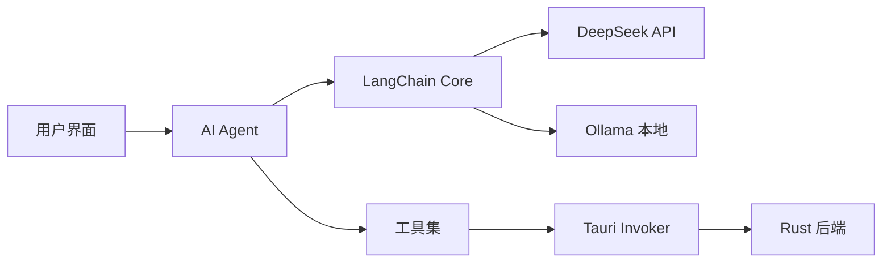

# AI Agent

## 概述

BiliBili ShadowReplay 集成了基于 LangChain 的 AI Agent，用于内容分析、总结和智能辅助。Agent 实现位于 `src/lib/agent/` 目录。

## 技术栈

- **LangChain Core** (@langchain/core): 核心框架
- **LangChain DeepSeek** (@langchain/deepseek): DeepSeek LLM 集成
- **LangChain Ollama** (@langchain/ollama): Ollama 本地模型支持

## 架构



## 主要功能

### 1. 内容分析

分析直播录播内容，提取关键信息：

```typescript
import { analyzeContent } from '$lib/agent';

const analysis = await analyzeContent({
  recordingId: 'xxx',
  transcript: '直播文字记录...',
});

// 返回结果
{
  summary: '直播内容总结',
  highlights: ['精彩片段1', '精彩片段2'],
  tags: ['游戏', '娱乐'],
  suggestedTitle: '建议的标题'
}
```

### 2. 智能切片建议

基于内容分析，建议切片时间点：

```typescript
import { suggestClips } from '$lib/agent';

const suggestions = await suggestClips({
  recordingId: 'xxx',
  transcript: '...',
  danmaku: [...], // 弹幕数据
});

// 返回建议的切片区间
[
  { start: 120, end: 300, reason: '精彩操作' },
  { start: 1200, end: 1500, reason: '搞笑片段' }
]
```

### 3. 标题和描述生成

为切片生成标题和描述：

```typescript
import { generateMetadata } from '$lib/agent';

const metadata = await generateMetadata({
  clipContent: '切片内容描述',
  context: '直播背景信息',
});

// 返回
{
  title: '生成的标题',
  description: '生成的描述',
  tags: ['标签1', '标签2']
}
```

## LLM 配置

### DeepSeek 配置

```typescript
import { ChatDeepSeek } from '@langchain/deepseek';

const model = new ChatDeepSeek({
  apiKey: 'your-api-key',
  model: 'deepseek-chat',
  temperature: 0.7,
});
```

### Ollama 本地模型

```typescript
import { Ollama } from '@langchain/ollama';

const model = new Ollama({
  baseUrl: 'http://localhost:11434',
  model: 'llama2',
});
```

## Agent 实现

### 基础 Agent 结构

```typescript
import { ChatPromptTemplate } from '@langchain/core/prompts';
import { RunnableSequence } from '@langchain/core/runnables';

// 创建提示模板
const prompt = ChatPromptTemplate.fromMessages([
  ['system', '你是一个直播内容分析助手...'],
  ['human', '{input}'],
]);

// 创建处理链
const chain = RunnableSequence.from([
  prompt,
  model,
  outputParser,
]);

// 执行
const result = await chain.invoke({
  input: '分析这段直播内容...'
});
```

### 带工具的 Agent

```typescript
import { DynamicStructuredTool } from '@langchain/core/tools';
import { AgentExecutor, createOpenAIFunctionsAgent } from 'langchain/agents';

// 定义工具
const tools = [
  new DynamicStructuredTool({
    name: 'get_recording_info',
    description: '获取录播信息',
    schema: z.object({
      recordingId: z.string(),
    }),
    func: async ({ recordingId }) => {
      const info = await invoke('get_recording', { recordingId });
      return JSON.stringify(info);
    },
  }),
  new DynamicStructuredTool({
    name: 'get_danmaku',
    description: '获取弹幕数据',
    schema: z.object({
      recordingId: z.string(),
      startTime: z.number().optional(),
      endTime: z.number().optional(),
    }),
    func: async ({ recordingId, startTime, endTime }) => {
      const danmaku = await invoke('get_danmaku', {
        recordingId,
        startTime,
        endTime,
      });
      return JSON.stringify(danmaku);
    },
  }),
];

// 创建 Agent
const agent = await createOpenAIFunctionsAgent({
  llm: model,
  tools,
  prompt,
});

// 创建执行器
const executor = new AgentExecutor({
  agent,
  tools,
});

// 执行任务
const result = await executor.invoke({
  input: '分析录播 xxx 的内容并建议切片'
});
```

## 提示工程

### 内容分析提示

```typescript
const ANALYSIS_PROMPT = `你是一个专业的直播内容分析助手。

任务：分析给定的直播录播内容，提取关键信息。

输入信息：
- 直播标题：{title}
- 直播时长：{duration}
- 文字记录：{transcript}
- 弹幕数据：{danmaku}

请提供：
1. 内容总结（100字以内）
2. 3-5个精彩片段的时间点和描述
3. 5个相关标签
4. 建议的切片标题

输出格式：JSON
`;
```

### 切片建议提示

```typescript
const CLIP_SUGGESTION_PROMPT = `基于直播内容分析，建议值得制作成切片的片段。

考虑因素：
1. 弹幕密度突然增加的时间段
2. 文字记录中的关键词（如"精彩"、"哈哈"、"牛"等）
3. 情绪高涨的片段
4. 完整的故事或事件

每个建议包括：
- 开始时间
- 结束时间
- 片段描述
- 推荐理由
- 预估热度（1-10分）

输出格式：JSON数组
`;
```

## 流式输出

对于长文本生成，使用流式输出提升用户体验：

```typescript
import { writable } from 'svelte/store';

export const streamingText = writable('');

async function generateWithStreaming(input: string) {
  streamingText.set('');

  const stream = await chain.stream({ input });

  for await (const chunk of stream) {
    streamingText.update(text => text + chunk.content);
  }
}
```

在组件中使用：

```svelte
<script>
  import { streamingText } from '$lib/agent';
</script>

<div class="streaming-output">
  {$streamingText}
</div>
```

## 错误处理

```typescript
async function safeAgentCall<T>(
  agentFunc: () => Promise<T>,
  fallback: T
): Promise<T> {
  try {
    return await agentFunc();
  } catch (error) {
    console.error('Agent call failed:', error);

    // 检查是否是 API 限流
    if (error.message.includes('rate limit')) {
      throw new Error('API 调用频率过高，请稍后再试');
    }

    // 检查是否是网络错误
    if (error.message.includes('network')) {
      throw new Error('网络连接失败，请检查网络设置');
    }

    // 返回默认值
    return fallback;
  }
}
```

## 性能优化

### 1. 缓存结果

```typescript
const analysisCache = new Map<string, any>();

async function analyzeWithCache(recordingId: string) {
  if (analysisCache.has(recordingId)) {
    return analysisCache.get(recordingId);
  }

  const result = await analyzeContent({ recordingId });
  analysisCache.set(recordingId, result);

  return result;
}
```

### 2. 批量处理

```typescript
async function batchAnalyze(recordingIds: string[]) {
  // 并发处理，但限制并发数
  const concurrency = 3;
  const results = [];

  for (let i = 0; i < recordingIds.length; i += concurrency) {
    const batch = recordingIds.slice(i, i + concurrency);
    const batchResults = await Promise.all(
      batch.map(id => analyzeContent({ recordingId: id }))
    );
    results.push(...batchResults);
  }

  return results;
}
```

### 3. 超时控制

```typescript
async function analyzeWithTimeout(input: any, timeout = 30000) {
  return Promise.race([
    analyzeContent(input),
    new Promise((_, reject) =>
      setTimeout(() => reject(new Error('Analysis timeout')), timeout)
    ),
  ]);
}
```

## 配置管理

在用户配置中管理 LLM 设置：

```typescript
interface LLMConfig {
  provider: 'deepseek' | 'ollama';
  apiKey?: string;
  baseUrl?: string;
  model: string;
  temperature: number;
  maxTokens: number;
}

// 从配置加载
export async function loadLLMConfig(): Promise<LLMConfig> {
  return await invoke('get_llm_config');
}

// 保存配置
export async function saveLLMConfig(config: LLMConfig) {
  await invoke('save_llm_config', { config });
}
```

## 最佳实践

1. **提示优化**: 清晰、具体的提示能获得更好的结果
2. **错误处理**: 始终处理 API 调用可能的失败
3. **用户反馈**: 显示加载状态和进度
4. **成本控制**: 缓存结果，避免重复调用
5. **隐私保护**: 不要将敏感信息发送到外部 API

## 调试

```typescript
// 启用调试日志
if (import.meta.env.DEV) {
  // 记录所有 LLM 调用
  const originalInvoke = chain.invoke;
  chain.invoke = async (input) => {
    console.log('[LLM Input]', input);
    const result = await originalInvoke.call(chain, input);
    console.log('[LLM Output]', result);
    return result;
  };
}
```

## 示例：完整的分析流程

```typescript
import { ChatDeepSeek } from '@langchain/deepseek';
import { ChatPromptTemplate } from '@langchain/core/prompts';
import { invoke } from '@tauri-apps/api/core';

export async function analyzeRecording(recordingId: string) {
  // 1. 获取录播信息
  const recording = await invoke('get_recording', { recordingId });

  // 2. 获取字幕（如果有）
  const subtitle = await invoke('get_subtitle', { recordingId });

  // 3. 获取弹幕数据
  const danmaku = await invoke('get_danmaku', { recordingId });

  // 4. 准备输入
  const input = {
    title: recording.title,
    duration: recording.duration,
    transcript: subtitle?.text || '',
    danmakuCount: danmaku.length,
    danmakuSample: danmaku.slice(0, 100), // 采样
  };

  // 5. 调用 LLM
  const model = new ChatDeepSeek({
    apiKey: await invoke('get_deepseek_key'),
    model: 'deepseek-chat',
  });

  const prompt = ChatPromptTemplate.fromTemplate(ANALYSIS_PROMPT);
  const chain = prompt.pipe(model);

  const result = await chain.invoke(input);

  // 6. 解析结果
  return JSON.parse(result.content);
}
```