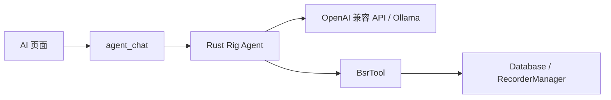

# AI Agent

## 概述

BiliBili ShadowReplay 使用基于 [Rig](https://github.com/0xPlaygrounds/rig) 的 Rust AI Agent，用于查询和分析 Recorder、Archive、Video、字幕与弹幕数据。

Agent 主体位于 `src-tauri/src/agent/`。前端的 `src/lib/agent/agent.ts` 负责发送消息；只读工具由 Rust 执行，需要确认的工具则由前端在用户明确同意后调用现有 Tauri 工具实现。

## 架构


```mermaid
graph LR
    UI[AI 页面] --> Command[agent_chat]
    Command --> Agent[Rust Rig Agent]
    Agent --> LLM[OpenAI 兼容 API / Ollama]
    Agent --> Tool[BsrTool]
    Tool --> Backend[Database / RecorderManager]
```

每次请求会携带前端当前保存的完整对话记录。用户、助手和工具消息会转换为 Rig 的真实角色消息，而不是拼接成单个文本提示。Rust Agent 在单次 command 内完成模型调用和只读工具循环，并将最终文本、工具调用轨迹及错误状态一起返回。

## 模型配置

UI 支持以下 Provider：

- `openai`：使用 OpenAI Chat Completions 兼容接口，需要 endpoint、API Key 和模型名。
- `ollama`：使用 Ollama 接口；endpoint 为空时默认使用 `http://localhost:11434`。

API Key 只随当前 `agent_chat` 请求传入 Rust 端，不写入后端数据库或工具结果。现有 UI 会在浏览器本地设置中保存模型配置，因此不要在共享设备上保存敏感密钥。

前端准备模型配置：

```typescript
import { agentChat, type AgentConfig } from '$lib/agent/agent';

const config: AgentConfig = {
  provider: 'openai',
  baseURL: 'https://api.example.com/v1',
  apiKey: 'your-api-key',
  model: 'model-name',
};
```

## 请求流程

前端直接传入完整消息列表：

```typescript
const response = await agentChat(config, messages);
// response.content: 最终回答或错误信息
// response.toolCalls: 已执行的只读调用，以及等待用户确认的调用
```

`agentChat` 最终调用的 Tauri command 请求结构为：

```typescript
interface AgentRequest {
  provider: 'openai' | 'ollama';
  endpoint: string;
  apiKey?: string;
  model: string;
  messages: Array<{
    role: 'user' | 'assistant' | 'tool';
    content: string;
    toolCalls?: Array<{ id: string; name: string; args: object }>;
    toolCallId?: string;
  }>;
}
```

## BSR 工具

Rust Agent 注册一个名为 `bsr` 的工具，通过带类型约束的 `oneOf` schema 选择具体 `action` 和参数。工具覆盖账户、录制器、录播、视频、字幕、弹幕、剪辑、转码和上传等原有能力。

- 账户与录制器：`get_accounts`、`get_recorder_list`、`get_recorder_info`
- 录播：`get_archives`、`get_archive`、`get_recent_record`、`get_recent_record_all`
- 视频与任务：`get_videos`、`get_all_videos`、`get_video`、`get_background_tasks`
- 字幕与弹幕：`get_archive_subtitle`、`get_danmu_record`
- 内容分析：`analyze_danmu_highlights`、`search_danmu_keywords`

工具在 Rust 进程内直接访问 `Database` 和 `RecorderManager`。`get_accounts` 返回前会屏蔽 Cookie，避免凭据进入模型上下文。

删除、上传、修改录制配置以及生成文件等操作不会在 Rust Agent 中自动执行。工具先返回 `confirmation_required`，前端展示工具名和完整参数；用户点击确认后，前端只执行该调用一次，追加具有匹配 `toolCallId` 的 ToolMessage，再携带完整历史继续 Agent。拒绝也会生成对应的 ToolMessage。存在未处理调用时，普通消息发送会被禁用。

## 工具调用轨迹

每次工具调用都会记录：

```typescript
interface ToolCall {
  id: string;
  name: string;
  args: Record<string, unknown>;
  executed: boolean;
  error?: string;
}
```

`executed: true` 表示工具已经在 Rust 端执行，仅用于展示，浏览器不会再次调用。`executed: false` 表示等待用户确认，前端只允许通过确认按钮执行。即使 Agent 在后续模型轮次中失败，已产生的工具轨迹也会随错误响应返回。

## 错误处理

配置错误或不支持的 Provider 会使 Tauri command 直接失败。模型请求失败、工具循环超出轮次等运行期错误会作为正常的 `AgentResponse` 返回，并包含：

- `error`：错误信息
- `toolCalls`：失败前已经执行的工具轨迹
- `content`：成功时的最终回答

前端将带有 `error` 的响应渲染为错误消息，同时保留工具调用记录。

## 对话历史

AI 页面将消息保存到浏览器 `localStorage`，刷新页面后恢复展示。每次新请求会发送当前完整消息列表，因此模型可以继续此前对话。

历史会随着对话增长并消耗更多上下文长度。若模型报告上下文过长，可通过页面的清空对话操作开始新会话。
