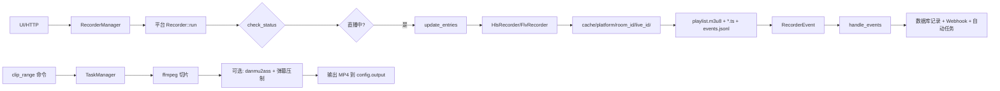

# bili-shadowreplay 架构分析与重构机会报告

**分析日期**: 2026-09-18
**分析范围**: 完整代码库 (110 个 Rust 文件, 58 个前端文件)
**目标**: 识别具体的重构机会,按影响力和风险排序

---

## 一、当前架构概览

### 1.1 技术栈与结构

**核心架构**: Tauri 2 桌面应用 (Svelte 5 前端 + Rust 后端) + 可选 headless HTTP 模式

**代码组织**:
```
├── src/                          # Svelte 前端 (3个入口点)
│   ├── App.svelte               # 主应用
│   ├── AppLive.svelte           # 直播播放器窗口
│   └── AppClip.svelte           # 切片编辑器窗口
│
├── src-tauri/                    # Rust 后端主应用
│   ├── src/
│   │   ├── main.rs              # 应用入口 (1096 行) - GUI/headless 双模式
│   │   ├── recorder_manager.rs  # 录制管理器 (1879 行)
│   │   ├── http_server/         # headless HTTP API
│   │   ├── handlers/            # Tauri IPC 命令处理
│   │   ├── ffmpeg/              # 应用级 FFmpeg 操作 (切片/弹幕/转码)
│   │   ├── subtitle_generator/  # 字幕生成 (Whisper-cpp/在线/PowerLive)
│   │   ├── database/            # SQLite 数据访问
│   │   ├── task/                # 异步任务队列
│   │   └── ...
│   │
│   └── crates/                   # Workspace 成员 crates
│       ├── recorder/            # 录制核心库
│       │   ├── platforms/       # 5个平台适配器 (Bilibili/Douyin/Huya/Kuaishou/TikTok)
│       │   ├── core/            # HLS/FLV 录制器
│       │   └── ffmpeg/          # 录制器级 FFmpeg 元数据提取
│       ├── danmu_stream/        # 弹幕流 (仅 Bilibili/Douyin/Kuaishou)
│       └── whisper-cpp-rs/      # Whisper.cpp FFI 封装
```

**支持的平台**:
- **已实现**: Bilibili (最完整), Douyin, Huya, Kuaishou, TikTok
- **桩代码**: Youtube, Xiaohongshu, Weibo (在 `PlatformType` 枚举中但未实现)

### 1.2 录制→切片流水线



**关键点**:
- 每个平台一个 `Recorder<Extra>` 实例,运行独立循环
- HLS 录制: 轮询 m3u8, 下载 TS 分段
- FLV 录制 (仅 TikTok): FFmpeg remux RTMP→HLS
- 弹幕通过 `danmu_stream` crate 并行收集到 `events.jsonl`
- 切片操作由 `TaskManager` 序列化执行,避免资源冲突

### 1.3 模块边界图

```
┌─────────────────────────────────────────────────────┐
│                    前端 (Svelte)                     │
│  invoker.ts ─┬─ Tauri IPC ──► handlers/             │
│              └─ HTTP /api/* ──► http_server (headless)│
└──────────────────────────┬──────────────────────────┘
                           │
┌──────────────────────────▼──────────────────────────┐
│                   State (共享状态)                    │
│  ┌─────────────────────────────────────────────┐    │
│  │ RecorderManager                             │    │
│  │  └─► recorder crate                         │    │
│  │       ├─ platforms (5 adapters)             │    │
│  │       └─ core (HLS/FLV)                     │    │
│  │            └─ danmu_stream (3 providers)    │    │
│  ├─────────────────────────────────────────────┤    │
│  │ Database (sqlx + 凭证加密)                   │    │
│  ├─────────────────────────────────────────────┤    │
│  │ ffmpeg (应用级切片/转码/字幕)                 │    │
│  ├─────────────────────────────────────────────┤    │
│  │ subtitle_generator (whisper-cpp/在线)        │    │
│  ├─────────────────────────────────────────────┤    │
│  │ TaskManager + WebhookPoster + Agent         │    │
│  └─────────────────────────────────────────────┘    │
└─────────────────────────────────────────────────────┘
```

---

## 二、重构机会清单 (优先级排序)

### 🔴 P0 - 高优先级 (高影响 × 中等风险)

#### R1. 平台适配器重复代码消除

**位置**: `src-tauri/crates/recorder/src/platforms/{bilibili,douyin,huya,kuaishou,tiktok}.rs`

**问题描述**:
五个平台适配器包含大量结构性重复:
- `check_status()` 方法: 几乎相同的结构 (调用平台 API → 更新 room_info/user_info → 检测直播状态变化 → 发送事件)
- `run()` 主循环: 完全相同的模式 (等待 → check_status → update_entries → 睡眠)
- `reset_recording()` / `reset_live()` / `end_live()`: 状态重置逻辑
- 只有 `Extra` 类型和平台特定 API 调用不同

**重复规模**:
- `bilibili.rs`: 678 行, 其中 ~400 行是通用模式
- `douyin.rs`: ~300 行可抽象
- `huya.rs`: ~250 行可抽象
- `kuaishou.rs`: ~280 行可抽象
- `tiktok.rs`: ~200 行可抽象
- **估计总重复**: ~1400 行代码

**示例重复** (check_status 结构):
```rust
// 每个平台都有这个模式:
async fn check_status(&self) -> bool {
    let pre_live_status = self.room_info.read().await.status;
    match api::get_room_info(...).await {  // 唯一差异: API 调用
        Ok(info) => {
            // 更新 room_info - 相同结构
            *self.room_info.write().await = RoomInfo { ... };
            // 更新 user_info - 相同结构
            *self.user_info.write().await = UserInfo { ... };
            // 检测状态变化 - 完全相同
            if pre_live_status != live_status {
                if live_status {
                    self.event_channel.send(RecorderEvent::LiveStart { ... });
                } else {
                    self.end_live().await;
                }
            }
            true
        }
        Err(e) => { /* 相同错误处理 */ }
    }
}
```

**建议方向**:
1. **模板方法模式**: 创建 `RecorderBase` 结构,包含通用循环和状态管理
2. **Trait 抽象**: 定义 `PlatformApi` trait:
   ```rust
   #[async_trait]
   trait PlatformApi {
       type Extra: Clone + Send + Sync;
       async fn fetch_room_info(&self) -> Result<RoomInfo, RecorderError>;
       async fn fetch_stream_url(&self, room_info: &RoomInfo) -> Result<String, RecorderError>;
       async fn get_platform_live_id(&self, room_info: &RoomInfo) -> String;
   }
   ```
3. **状态机提取**: 将 `LiveSession` 生命周期 (未开播 → 直播中 → 录制中 → 结束) 提取为显式状态机

**工作量**: Large (3-5 天)
**风险**: 中等 - 需要大量测试验证各平台行为一致性
**影响**: ⭐⭐⭐⭐⭐ - 未来新增平台只需实现 3-5 个方法,而非复制 500 行代码

**前置条件**: R3 (测试基础设施) 应先建立

---

#### R2. RecorderManager 枚举消除

**位置**: `src-tauri/src/recorder_manager.rs` (1879 行)

**问题描述**:
`RecorderType` 枚举导致方法爆炸:
```rust
pub enum RecorderType {
    BiliBili(BiliRecorder),
    Douyin(DouyinRecorder),
    Huya(HuyaRecorder),
    Kuaishou(KuaishouRecorder),
    TikTok(TikTokRecorder),
}

impl RecorderType {
    async fn run(&self) {
        match self { /* 5 个分支 */ }
    }
    async fn stop(&self) {
        match self { /* 5 个分支 */ }
    }
    async fn info(&self) -> RecorderInfo {
        match self { /* 5 个分支 */ }
    }
    async fn enable(&self) {
        match self { /* 5 个分支 */ }
    }
    async fn disable(&self) {
        match self { /* 5 个分支 */ }
    }
}
```

每个方法都是 5 行几乎相同的 match 语句,只是分发到不同类型的同名方法。新增平台需要修改 5+ 处。

**建议方向**:
使用 trait object 代替枚举:
```rust
pub struct RecorderManager {
    recorders: Arc<RwLock<HashMap<String, Arc<dyn RecorderTrait>>>>,
    // ...
}
```

`RecorderTrait` 已经存在于 `recorder/src/traits.rs`,但当前 `RecorderManager` 没有使用它。

**工作量**: Medium (2-3 天)
**风险**: 低 - `RecorderTrait` 已定义,主要是重构现有代码
**影响**: ⭐⭐⭐⭐ - 简化 `RecorderManager`,消除维护负担

**相关**: 与 R1 结合可获得最大收益

---

#### R3. 测试基础设施建立

**位置**: 全局 - 当前几乎没有测试文件

**问题描述**:
```bash
$ find . -name "*test*.rs" -o -name "tests/" | wc -l
0
```

只有嵌入式的 `#[cfg(test)] mod tests` 用于测试工具函数,缺少:
- 平台适配器的集成测试 (mock API)
- 录制流水线端到端测试
- FFmpeg 操作单元测试
- 前端组件测试

**阻碍因素**:
- R1/R2 等重构风险高,因为无法验证行为不变性
- Bug 修复依赖手动测试
- CI 只检查编译,不验证功能

**建议方向**:
1. **Mock 框架**: 使用 `mockall` 或 `mockito` 为平台 API 创建 mock
2. **Fixture 数据**: 在 `test_videos/` 添加各平台的真实 API 响应 JSON
3. **HLS 录制器测试**: 使用本地 HTTP 服务器提供测试 m3u8
4. **快照测试**: 对 FFmpeg 命令行参数和 danmu2ass 输出做快照测试

**工作量**: Medium (2-4 天)
**风险**: 无 - 纯增量
**影响**: ⭐⭐⭐⭐⭐ - 解锁所有其他重构的安全执行

**立即可做**: 优先级最高,阻碍其他重构

---

### 🟡 P1 - 中等优先级 (中等影响 × 低/中风险)

#### R4. main.rs 上帝文件拆分

**位置**: `src-tauri/src/main.rs` (1096 行)

**问题描述**:
单文件承载:
- SQL 迁移内联 (100+ 行)
- GUI 设置 (插件注册, tray 初始化, 事件处理)
- Headless 设置 (Clap args, Axum 路由)
- 90+ 个 Tauri 命令注册 (814-912 行)
- 日志/配置/数据库引导

**建议方向**:
1. **迁移模块**: 将 SQL 移到 `migration/` 下的单独文件
2. **命令注册**: 提取 `handlers/mod.rs::register_handlers()`
3. **GUI 模块**: 提取 `gui.rs` (app setup, tray, window 事件)
4. **Headless 模块**: 已有 `http_server/`,将 main 中的 headless 启动逻辑移入

**工作量**: Small (1-2 天)
**风险**: 低 - 纯结构重组
**影响**: ⭐⭐⭐ - 提高可读性,便于后续维护

---

#### R5. FFmpeg 模块重复消除

**位置**:
- `src-tauri/src/ffmpeg/` (应用级, 2018 行)
- `src-tauri/crates/recorder/src/ffmpeg/` (录制器级, ~150 行)

**问题描述**:
两个 `ffmpeg` 模块:
- **应用级** (`src/ffmpeg/`): 切片, 弹幕压制, 转码, 硬件加速, 字幕生成
- **录制器级** (`crates/recorder/src/ffmpeg/`): 元数据提取 (`VideoMetadata`)

`VideoMetadata` 结构在两处重复定义,`extract_video_metadata` 逻辑也可能重复。

**建议方向**:
1. 将录制器级 FFmpeg 合并到应用级,或
2. 创建共享 `ffmpeg-utils` crate (如果 recorder 想保持独立)

**工作量**: Small (1 天)
**风险**: 低
**影响**: ⭐⭐⭐ - 避免未来行为分歧

---

#### R6. 平台类型重复定义消除

**位置**:
- `src-tauri/crates/recorder/src/platforms/mod.rs::PlatformType` (8 variants)
- `src-tauri/crates/recorder/src/core/stream_info.rs::PlatformType` (5 variants)

**问题描述**:
两个 `PlatformType` 枚举:
- `platforms/mod.rs`: `BiliBili`, `Douyin`, `Huya`, `Youtube`, `Kuaishou`, `Xiaohongshu`, `TikTok`, `Weibo`
- `core/stream_info.rs`: `Bilibili` (注意大小写), `Douyin`, `Huya`, `Kuaishou`, `TikTok`

容易混淆,且 `stream_info.rs` 的 `PlatformStreamInfo` trait 实际上未被主流水线使用 (文档过时)。

**建议方向**:
1. 删除 `core/stream_info.rs` 的枚举,统一使用 `platforms/mod.rs` 的定义
2. 如果 `PlatformStreamInfo` trait 有用,将其迁移到 `platforms/mod.rs`
3. 或者,完成 `stream_info` 抽象的实现并迁移主流水线使用它

**工作量**: Small (1 天)
**风险**: 低 (stream_info trait 当前未使用)
**影响**: ⭐⭐⭐ - 防止平台枚举分叉

---

#### R7. 前端状态管理层引入

**位置**: `src/` (Svelte 前端)

**问题描述**:
- 几乎没有 Svelte store (只有 `stores/version.ts`)
- 页面组件直接调用 `invoke("command", args)` (100+ 次)
- 重复的加载/错误处理逻辑
- 无集中的数据缓存或乐观更新

**示例** (Room.svelte):
```typescript
let recorders = [];
onMount(async () => {
  recorders = await invoke("list_recorders");  // 重复模式 1
});
async function deleteRecorder(id) {
  await invoke("delete_recorder", { id });     // 重复模式 2
  recorders = await invoke("list_recorders");  // 重新获取
}
```

每个页面都重复相同的获取→渲染→操作→重新获取模式。

**建议方向**:
引入轻量状态管理:
```typescript
// stores/recorders.ts
import { writable, derived } from 'svelte/store';
import { invoke } from '$lib/invoker';

function createRecordersStore() {
  const { subscribe, set, update } = writable([]);

  return {
    subscribe,
    load: async () => {
      const data = await invoke('list_recorders');
      set(data);
    },
    delete: async (id) => {
      await invoke('delete_recorder', { id });
      update(items => items.filter(r => r.id !== id)); // 乐观更新
    }
  };
}

export const recorders = createRecordersStore();
```

**工作量**: Medium (2-3 天)
**风险**: 低
**影响**: ⭐⭐⭐⭐ - 减少前端重复,改善 UX (乐观更新)

---

### 🟢 P2 - 低优先级 (补充改进)

#### R8. 弹幕平台覆盖率对齐

**位置**: `src-tauri/crates/danmu_stream/src/provider/`

**问题描述**:
- `danmu_stream` 只支持 3 个平台: Bilibili, Douyin, Kuaishou
- `recorder` 支持 5 个平台: + Huya, TikTok
- Huya 录制器有弹幕任务启动代码,但立即 abort (空操作)
- TikTok 弹幕只有空文件存储

不一致性导致用户困惑 (为什么 Huya 没有弹幕?)

**建议方向**:
1. 明确标注哪些平台不支持弹幕 API (TikTok 可能无公开协议)
2. 实现 Huya 弹幕 provider 或正式移除桩代码
3. 在 UI 中禁用不支持平台的弹幕功能

**工作量**: Medium (需要逆向工程 Huya 弹幕协议)
**风险**: 低 (增量功能)
**影响**: ⭐⭐⭐ - 功能完整性

---

#### R9. Deno 运行时整合

**位置**:
- `recorder/Cargo.toml`: `deno_core` 依赖 (Douyin a_bogus 签名)
- `danmu_stream/Cargo.toml`: `deno_core` 依赖 (Douyin webmssdk 签名)

**问题描述**:
两个 crate 各自嵌入 Deno 运行时用于执行 JavaScript 反爬代码,每个 ~5MB 依赖开销。

**建议方向**:
1. 创建 `douyin-crypto` 子 crate,统一提供 Douyin 签名服务
2. 或使用 wasm 版本的签名算法 (如果存在)

**工作量**: Small (1-2 天)
**风险**: 低
**影响**: ⭐⭐ - 减少编译时间和二进制大小

---

#### R10. 数据库耦合解耦

**位置**: `src-tauri/src/database/mod.rs` 实现 `recorder::platforms::bilibili::api::UserInfoCache`

**问题描述**:
应用层数据库模块实现了 `recorder` crate 的 Bilibili 特定 trait。这是错误的依赖方向 (库不应依赖应用)。

**建议方向**:
- 在 `recorder` crate 定义通用 `UserInfoCache` trait (不绑定 Bilibili)
- 应用层实现通用版本

**工作量**: Small (1 天)
**风险**: 低
**影响**: ⭐⭐ - 改善架构清晰度

---

## 三、热点验证结果

### ✅ 已确认的架构问题

| 假设 | 状态 | 详情 |
|------|------|------|
| 平台适配器重复 | ✅ 严重 | ~1400 行重复代码 |
| RecorderType 枚举爆炸 | ✅ 存在 | 5 个方法 × 5 个平台 = 25 个分支 |
| 大型上帝模块 | ✅ 存在 | `main.rs` 1096, `recorder_manager.rs` 1879, `api_server.rs` 2046 |
| FFmpeg 管道耦合 | ⚠️ 部分 | 两层 FFmpeg 模块,有重复定义 |
| 配置和特性标志 | ✅ 清晰 | `cuda` feature, `headless`/`gui` 互斥,设计合理 |
| 前后端状态管理 | ✅ 紧耦合 | 前端无 store 层,直接 invoke,页面间无状态共享 |
| 测试覆盖缺口 | ✅ 严重 | 0 个独立测试文件,只有内联单元测试 |

### ❌ 未发现显著问题的领域

| 领域 | 评估 |
|------|------|
| 错误处理 | ✅ 使用 `thiserror`, `.unwrap()` 使用适度 (主要在测试/工具) |
| 异步任务生命周期 | ✅ `TaskManager` 设计合理,支持优先级和取消 |
| NVENC/硬件加速 | ✅ 清晰封装在 `ffmpeg/hwaccel.rs` |

---

## 四、不建议触碰的稳定区域

### 🔒 高风险/低回报区域

1. **Whisper-cpp FFI 封装** (`crates/whisper-cpp-rs/`)
   - **原因**: FFI 代码稳定,cuda feature 已抽象,重构收益小

2. **平台 API 响应结构** (`platforms/*/response.rs`)
   - **原因**: 与外部 API 强绑定,需匹配实际响应格式

3. **弹幕协议实现** (`danmu_stream/provider/`)
   - **原因**: 逆向工程成果,改动可能破坏协议兼容性

4. **数据库迁移逻辑** (`migration/`)
   - **原因**: 已部署的迁移不应修改,用户数据风险高

5. **深度链接处理** (`App.svelte` deep link 解析)
   - **原因**: 与系统注册绑定,改动需要大量测试

---

## 五、建议执行顺序 (如果只做 2-3 项)

### 方案 A: 稳健路线 (推荐)
```
1. R3 - 建立测试基础设施 (4 天)
   └─ 先建立安全网
2. R2 - RecorderManager 枚举消除 (3 天)
   └─ 见效快,风险低,解锁平台扩展
3. R4 - main.rs 拆分 (2 天)
   └─ 提高可维护性
```
**总投入**: 9 天
**收益**: ⭐⭐⭐⭐ (测试覆盖 + 架构清晰度)

### 方案 B: 高影响路线
```
1. R3 - 建立测试基础设施 (4 天)
2. R1 - 平台适配器重构 (5 天)
   └─ 需要 R3 先完成
3. R2 - RecorderManager 枚举消除 (3 天)
   └─ 与 R1 结合收益最大
```
**总投入**: 12 天
**收益**: ⭐⭐⭐⭐⭐ (消除最大重复源,简化未来开发)

### 方案 C: 快速胜利路线 (如果时间有限)
```
1. R4 - main.rs 拆分 (2 天)
2. R6 - PlatformType 重复消除 (1 天)
3. R5 - FFmpeg 模块合并 (1 天)
```
**总投入**: 4 天
**收益**: ⭐⭐⭐ (可见的代码清理,无功能风险)

---

## 六、指标和验证

### 重构前基线指标

| 指标 | 当前值 |
|------|--------|
| Rust 文件总数 | 110 |
| 最大文件行数 | 2046 (`api_server.rs`) |
| 平台适配器重复代码估算 | ~1400 行 |
| 测试文件数 | 0 |
| RecorderType match 分支数 | 25 |
| PlatformType 定义数 | 2 |
| FFmpeg 模块数 | 2 |
| main.rs 行数 | 1096 |
| .unwrap() 调用数 | ~130 |
| 平台数量 (已实现) | 5 |
| 平台数量 (danmu 支持) | 3 |

### 重构成功标准

- **R1**: 平台适配器代码减少 40%+, 新增平台只需 <200 行代码
- **R2**: `RecorderManager` 消除所有 match 语句,新增平台 0 行改动
- **R3**: 测试覆盖率 >60% (关键路径), CI 包含集成测试
- **R4**: `main.rs` <400 行, SQL 迁移完全分离
- **R7**: 前端 `invoke` 调用减少 50%+, 页面组件 LOC 减少 20%+

---

## 七、风险评估矩阵

```
         低风险                中风险              高风险
   ┌──────────────────────────────────────────────────────┐
高  │                                                      │
影  │  R3 测试基础   R4 main拆分                 R1 平台重构│
响  │  R6 枚举合并   R5 FFmpeg合并               R2 trait化 │
   │                                                      │
   ├──────────────────────────────────────────────────────┤
中  │  R9 Deno整合   R7 前端store                          │
影  │  R10 数据库解耦                                       │
响  │                                                      │
   ├──────────────────────────────────────────────────────┤
低  │  R8 弹幕对齐                                         │
影  │                                                      │
响  │                                                      │
   └──────────────────────────────────────────────────────┘
```

**推荐优先级**: 低风险高影响 > 中风险高影响 > 低风险中影响

---

## 八、结论

bili-shadowreplay 是一个功能丰富的成熟项目,主要架构问题集中在:

1. **过度重复**: 平台适配器代码大量复制粘贴
2. **枚举反模式**: `RecorderType` 导致维护负担
3. **测试空白**: 缺少集成测试阻碍安全重构
4. **上帝模块**: `main.rs` 和 `recorder_manager.rs` 承载过多职责

**立即可执行**: R3 (测试) → R2 (枚举) → R4 (main 拆分) 路线风险最低,可在 9 天内完成,显著提升代码质量。

**最大价值**: R1 (平台重构) 是最大机会,但需要先建立 R3 测试基础。完成后,新增直播平台将从 "复制 500 行" 变为 "实现 5 个方法"。

**避免过度工程化**: 当前错误处理、异步任务管理、配置系统设计合理,无需重构。

---

**附录: 关键文件索引**

| 关注点 | 路径 |
|--------|------|
| 应用入口 | `src-tauri/src/main.rs` |
| 录制管理 | `src-tauri/src/recorder_manager.rs` |
| 平台适配器 | `src-tauri/crates/recorder/src/platforms/` |
| 录制核心 | `src-tauri/crates/recorder/src/core/` |
| FFmpeg 操作 | `src-tauri/src/ffmpeg/` |
| 前端桥接 | `src/lib/invoker.ts` |
| Trait 定义 | `src-tauri/crates/recorder/src/traits.rs` |
| 错误类型 | `src-tauri/crates/recorder/src/errors.rs` |
| 任务管理 | `src-tauri/src/task/mod.rs` |
