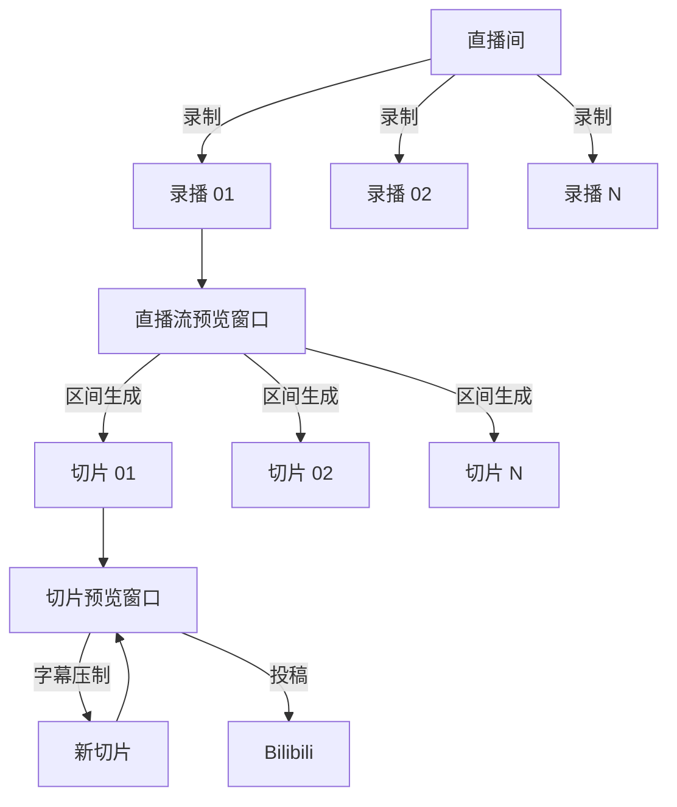

# 工作流程

- 直播间：各个平台的直播间
- 录播：直播流的存档，每次录制会自动生成一场录播记录
- 切片：从直播流中剪切生成的视频片段
- 投稿：将切片上传到各个平台（目前仅支持 Bilibili）

下图展示了它们之间的关系：

```mermaid
flowchart TD
    A[直播间] -->|录制| B[录播 01]
    A -->|录制| C[录播 02]
    A -->|录制| E[录播 N]

    B --> F[直播流预览窗口]

    F -->|区间生成| G[切片 01]
    F -->|区间生成| H[切片 02]
    F -->|区间生成| I[切片 N]

    G --> J[切片预览窗口]

    J -->|字幕压制| K[新切片]

    K --> J

    J -->|投稿| L[Bilibili]

```
